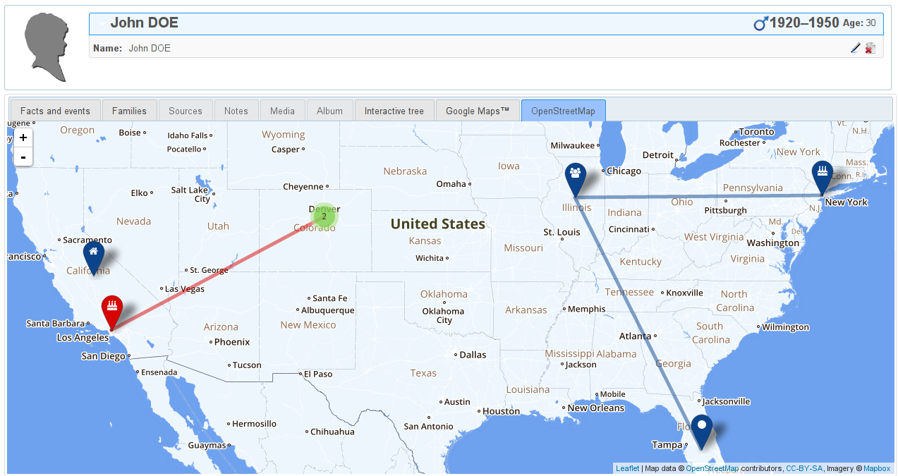

This is a [webtrees](http://webtrees.net) plugin for displaying location data on openstreetmap tiles, and displayed via leaflet.

## Requirements
This module requires webtrees 1.5+.

For now, this module relies on the Google Maps module. In the future, the plan is to remove that requirement.

## Installation
### via zip/tarball
Download the plugin, based on your webtrees version, and unpack it into `webtrees/modules/openstreetmap`

| Webtrees version | zip | tarball |
|------------------|-----|---------|
| >= 1.7.x         | [zip](https://github.com/dkniffin/webtrees-openstreetmap/archive/v1.7.zip) | [tar.gz](https://github.com/dkniffin/webtrees-openstreetmap/archive/v1.7.tar.gz) |
| < 1.7.x          | [zip](https://github.com/dkniffin/webtrees-openstreetmap/archive/v1.6.zip) | [tar.gz](https://github.com/dkniffin/webtrees-openstreetmap/archive/v1.6.tar.gz) |

### via git

`git clone https://github.com/oddityoverseer13/webtrees-openstreetmap.git <WEBTREES_MODULE_DIR>/openstreetmap`

## Contributing

Feel free to open a PR with any changes you'd like to make to this plugin. I don't have a whole lot of time to devote to this, but I will definitely review (and probably merge) any PRs in a timely manner.
